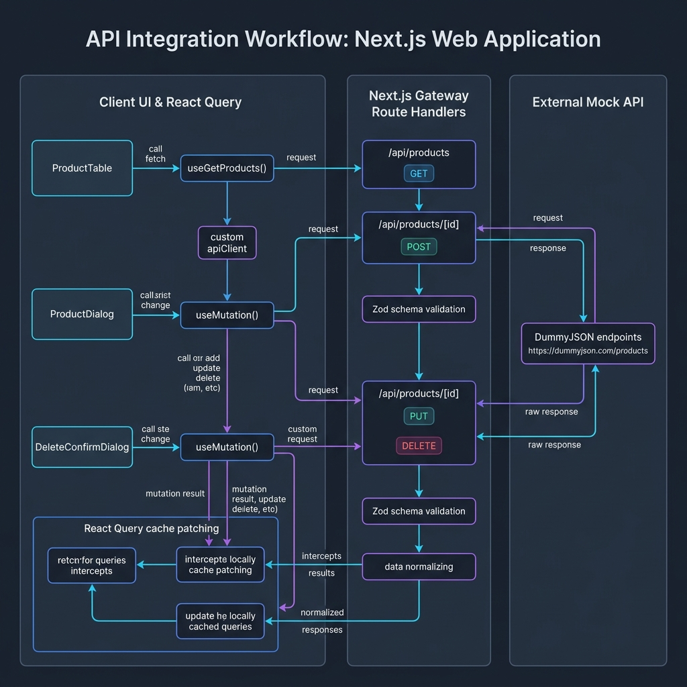

# AuraStore - Next.js API Integration Dashboard

AuraStore is a modern, high-performance, and responsive inventory management dashboard built on Next.js. It implements type-safe, real-time CRUD operations, type-safe query parameter state synchronization, and a custom stateless API gateway architecture.

---

## 🏗️ Architecture & API Integration Workflow

AuraStore uses a two-tier backend architecture: a local **Next.js Gateway** bridging the client application with an **External API** (DummyJSON). This design ensures security, query optimization, and schema mapping.

### API Integration Flowchart
The following diagram illustrates the flow of data, API boundaries, Zod schema validation points, and client-side cache updates:



### Data Flow Overview

1. **Query Parameters & Routing**:
   Filters, searching, and pagination state are managed via `nuqs` as URL search parameters. Changing a search term or page number automatically updates the URL query string.
2. **React Query Fetching**:
   The URL search parameters trigger the [useGetProducts](file:///f:/Personal%20Work/Rakib%20vai/api-integration/src/hooks/use-products.ts#L23) hook. React Query resolves its key dependencies and invokes the [apiClient](file:///f:/Personal%20Work/Rakib%20vai/api-integration/src/lib/api-client.ts) to send a request to the local API endpoint (`/api/products?q=...&page=...`).
3. **Next.js API Gateway (Server-side)**:
   The local Next.js Route Handler ([route.ts](file:///f:/Personal%20Work/Rakib%20vai/api-integration/src/app/api/products/route.ts)):
   - Receives the request and validates parameters.
   - Triggers server-side fetch from the external DummyJSON API (`https://dummyjson.com/products`).
   - Maps raw JSON data to the Zod validated schema (handling custom stable UUID generation).
   - Resolves sorting, searching, and pagination logic before returning the refined dataset back to the browser.
4. **Stateless Mutating & Client Cache Patching**:
   - Because mock external APIs (like DummyJSON) are stateless and do not persist writes (e.g. newly created products are lost on subsequent requests), mutations are simulated by **patching the React Query cache in place**.
   - Upon a successful POST/PUT/DELETE response, the mutations (`useCreateProduct`, `useUpdateProduct`, `useDeleteProduct`) intercept the cached queries and use `queryClient.setQueriesData` to prepend, update, or filter the local cached lists dynamically. This guarantees that user changes persist throughout their session without triggering cache invalidation cycles that would reset the data.

---

## 🛠️ Technology Stack & Library Briefs

Here is an overview of the core libraries selected for this project and the reasons for their inclusion:

### Core Framework & Routing
* **Next.js 16 (App Router)**: Provides high-performance server-side rendering, layout optimization, static generation, and unified backend API route endpoints.

### State & Cache Syncing
* **Zustand**: A lightweight, fast, and simple state-management hook. Used to declare feature-based UI states like view configuration (grid vs table) and form dialog triggers.
* **TanStack React Query**: Manages asynchronous server state, automated loading indications, deduplication of requests, and complex caching strategies.
* **Nuqs**: Provides type-safe hooks for syncing React state with URL search parameters (like filters and pagination pages), making states completely bookmarkable.

### Forms & Validation
* **Zod**: A TypeScript-first schema declaration and validation library. It is used to define the core `Product` data contracts, validating inputs on the client before submission, and securing the Next.js backend endpoints during request parsing.
* **React Hook Form**: Minimizes form re-renders and coordinates validation. Uses the `@hookform/resolvers` adapter to integrate validation schemas directly from Zod.

### Design & Aesthetics
* **Shadcn UI**: A collection of beautifully designed, accessible components built using Radix UI and Tailwind CSS, providing the foundation for our dialogs, dropdowns, tables, and buttons.
* **Framer Motion**: Delivers smooth fluid micro-animations for grid layout cards, loader skeletons, and slide-out panels.
* **Tailwind CSS**: A utility-first CSS framework for custom premium layout styling, support for HSL color variables, and layout responsiveness.
* **Sonner**: An elegant toast notification engine with rich animation styles and context status feedback.
* **Lucide React**: Out-of-the-box vector icon utilities.

---

## 🚀 Getting Started

### 1. Install Dependencies
```bash
npm install
```

### 2. Run the Development Server
```bash
npm run dev
```
Open [http://localhost:3000](http://localhost:3000) in your browser.

### 3. Build for Production
To trigger TypeScript checks, lint checks, and the production compiler:
```bash
npm run build
```
